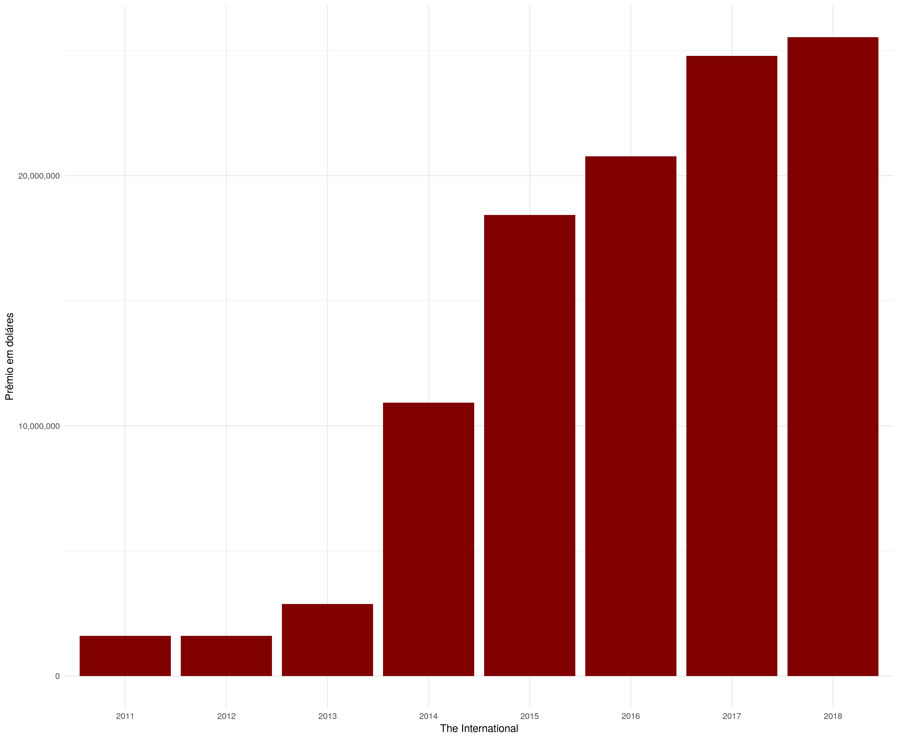

# Defense of the Ancients (Dota)

**Este repositório tem como objetivo manter os programas e arquivos do trabalho de
conclusão de curso.**

O tema do trabalho é o jogo Dota2 que  é um dos maiores jogos de computador da
atualidade, talvez não o mais jogado mas de longe o mais bem pago. O campeonato
mais famoso é o [The International](http://www.dota2.com/international/overview).
No gráfico abaixo pode-se observar a premiação total dos últimos anos.

O objetivo final do trabalho é avaliar se a inclusão de variáveis explicativas
relacionadas ao **jogador** aumentam o poder preditivo de modelos  apresentados na
literatura. As principais dificuldades na realização do trabalho é a coleta dos
dados, que por causa do objetivo torna o processo de adquirir dados mais complexo
sendo que é necessário coletar o histórico passado de cada jogador presente em cada
partida.

Este trabalho estará em constante atualizações até a sua entrega final que está
marcada para o final de julho/2019.

